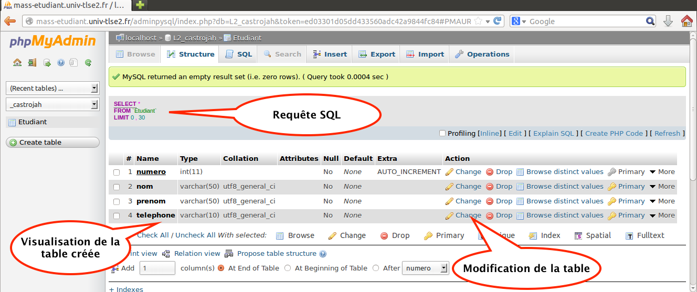

## MariaDB


MariaDB est un Système de Gestion de Base de Données (SGBD) relationnel. 

* "fork" de MySQL acquis par Oracle Corporation en janvier 2008. 
* SGBD parmi les plus utilisés au monde -- grand public (applications web principalement) et professionnels ;
* En concurrence avec Oracle, Informix et Microsoft SQL Server.


##phpMyAdmin


L’outil phpMyAdmin est développé en PHP et offre une interface intuitive pour l’administration des base de données du serveur.

Cet outil permet de :

* créer de nouvelles bases
* créer/modifier/supprimer des tables
* afficher/ajouter/modifier/supprimer des tuples dans des tables
* effectuer des sauvegarde de la structure et/ou des données
* effectuer n’importe quelle requête
* gérer les privilèges des utilisateurs


##Architecture pour phpMyAdmin et MariaDB

<center>


</center>

##phpMyAdmin - Se connecter
URL du serveur phpMyAdmin :

<center>
http://mi-mariadb.univ-tlse2.fr/mimyadmin/index.php

</center>

Identifiants de connexion (identifiant et mot de passe) habituels


#phpMyAdmin

##phpMyAdmin - Page d'accueil


##phpMyAdmin - Créer une table dans une base


##phpMyAdmin - Créer une table dans une base


##phpMyAdmin - Modifier une table dans une base




##phpMyAdmin - Insérer des tuples dans une table


##phpMyAdmin - Faire des requêtes SQL


##phpMyAdmin - Importer du code SQL 


##L'architecture PHP et MySQL - Transfert FTP

<center>

</center>
##L'architecture PHP et MySQL - Requête page web

<center>

</center>

#L'interface MariaDB/PHP

## L'interface MariaDB/PHP - Connexion
*Comme MariaDB est un "fork" de MySQL, les opérations sont les quasi-identiques à MySQL*

**PHP communique avec MySQL par l’intermédiaire d’un ensemble de fonctions**

| Opération| Description |
|----|-------|
|mysqli_connect()    | Pour établir une connexion avec MySQL, pour un compte utilisateur et un serveur donnés |
|mysqli_select_db()  | Permet de se placer dans le contexte d’une base de données |


## L'interface MariaDB/PHP - Requêtes

**PHP communique avec MySQL par l’intermédiaire d’un ensemble de fonctions**

| Opération| Description |
|----|-------|
|mysqli_query()|Exécuter une requête SQL ou n’importe quelle commande MySQL
|mysqli_fetch_object()|récupérer une des lignes du résultat, et positionne le curseur sur la ligne suivante. La ligne est représentée sous forme d’un objet (un groupe de valeurs)|
|mysqli_fetch_row()|récupérer une des lignes du résultat, et positionne le curseur sur la ligne suivante. La ligne est représentée sous forme d’un tableau (une liste de valeurs)|
|mysqli_error()|Renvoyer le message de la dernière erreur rencontrée|

#Exemple de connexion et d'interrogation simple

##Exemple : Code PHP de connexion ...

```php

<?php

    require("connect.php"); 
    $connexion = mysqli_connect(SERVEUR, NOM, PASSE);

 	if (!$connexion)
 	{
	  echo("Desolé, connexion à ".SERVEUR." impossible\n");
    exit;
	}
 	if (!mysqli_select_db($connexion,BASE))
	{
    echo("Désolé, accès à la base ". BASE ." impossible\n");
 		exit;
	}
  //...
```
## ... et d'interrogation simple

```php
  //...
  $resultat =  mysqli_query($connexion,"select * from Employes");
  
  if ($resultat)
  {
    while ($emp = mysqli_fetch_object ($resultat))
    {
      echo($emp->Id.", de nom ".$emp->Nom." ".$emp->Prenom.", né le ".$emp->Naissance."\n");
    }
  }
  else
  {
    echo("<b>Erreur dans l'exécution de la requête. </b><br/>");
    echo("<b>Message de mySQL: </B>").mysqli_error($connexion);
  }
?>
```

##Exemple : Inclusion de fichiers et constantes
Intègre le contenu d’un fichier (ici `connect.php`) dans le script courant.
```php
	require("connect.php");
```

Dans `connect.php`, création des constantes `NOM`, `PASSE`, `SERVEUR` et `BASE` :
```php
<?php
    // fichier contenant les constantes de connexion
    define('NOM', "!!!"); // votre login MySQL
    define('PASSE', "!!!"); // votre mot de passe MySQL
    define('SERVEUR', "10.10.190.39"); // IP du serveur mi-mariadb.univ-tlse2.fr
    ###<b>
    define('BASE', "17_L2_LoginPhpMyAdmin"); // nom de la base de données sur phpMyAdmin
    ###</b>
?>
```

*Remarque : L'extension `.php` permet au programme serveur de soumettre le fichier au filtre de l’interpréteur PHP (son contenu n’est du coup jamais visible par le client web)*


##Exemple : Connexion au serveur

* `mysqli_connect` essaie d’établir une connexion avec le serveur MySQL :
    * Succès : valeur positive utilisée pour dialoguer avec le serveur
    * Echec : valeur nulle et message d’erreur

```php
$connexion = mysqli_connect(SERVEUR,NOM,PASSE);
if (!$connexion)
{
  echo "Desolé, connexion à ".BASE." impossible\n";
  exit;
}
```

---

* `mysqli_select_db` renvoie une valeur positive si l’accès à la base réussit

```php
if (!mysqli_select_db($connexion,BASE))
{
  echo "Désolé, accès à la base ".BASE." impossible\n";
  exit;
}
```

##Exécution de la requête

* `mysqli_query()` renvoie une valeur positive (1) si la fonction s’exécute correctement

```php
$resultat = mysqli_query($connexion,"select * from Employes");
```

* en cas d’erreur, le message fourni par MySQL est affiché via la fonction `mysqli_error()`

```php
if ($resultat)
{ ... }
else
{
  echo("<b>Erreur dans l'exécution de la requête. </b><br/>");
  ###<b>
  echo("<b>Message de mySQL: </b>").mysqli_error($connexion);
  ###</b>
}
```

##Affichage du résultat (1/2)
<center>
**Si la requête réussit, il faut récupérer le résultat**

</center>

On parcourt les lignes une à une avec un **curseur** et on applique le traitement **à chaque ligne** individuellement

```php
$emp = mysqli_fetch_object($resultat);
```

La fonction `mysqli_fetch_object` :

1. prend une ligne du résultat (en commençant par la première ligne) 
2. et positionne le curseur sur la ligne suivante

Quand toutes les lignes ont été parcourues, la fonction renvoie la valeur `0`.

##Affichage du résultat (2/2)

Chaque ligne est renvoyée sous forme d’un objet (`$emp` dans l’exemple)

On accède à chaque attribut de l’objet avec l’opérateur « `->` »

```php
while ($emp = mysqli_fetch_object($resultat))
{
  echo($emp->Id.", de nom ".$emp->Nom." ".$emp->Prenom.", né le ".$emp->Naissance."\n");
}
```


##Rappel : connexion et requête simple en PHP

<div class="small">
```php
<?php
    require("connect.php"); 
    $connexion = mysqli_connect(SERVEUR, NOM, PASSE);

 	if (!$connexion)
 	{
	  echo("Desolé, connexion à ".SERVEUR." impossible\n");
    exit;
	}
 	if (!mysqli_select_db($connexion,BASE))
	{
    echo("Désolé, accès à la base ". BASE ." impossible\n");
 		exit;
	}
	
  $resultat =  mysqli_query($connexion,"select * from Employes");
  
  if ($resultat)
  {
    while ($emp = mysqli_fetch_object ($resultat))
    {
      echo($emp->Id.", de nom ".$emp->Nom." ".$emp->Prenom.", né le ".$emp->Naissance."\n");
    }
  }
  else
  {
    echo("<b>Erreur dans l'exécution de la requête. </b><br/>");
    echo("<b>Message de mySQL: </B>").mysqli_error($connexion);
  }
?>
```
</div>

#Mise en pratique 

---

Faire les exercices 1, 2 et 3 de la feuille de TP 3

