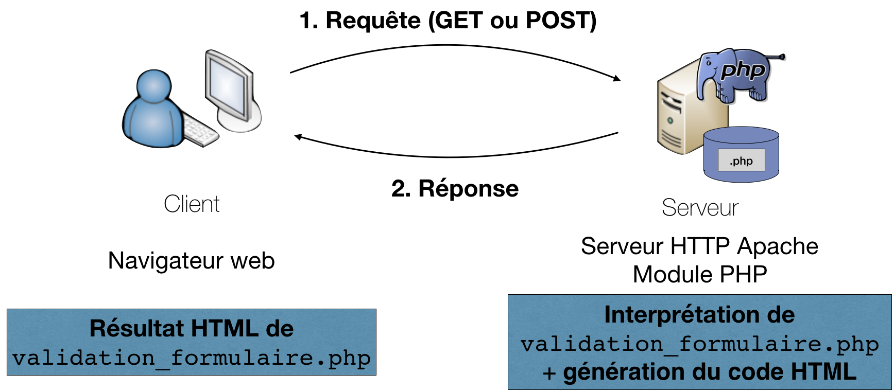
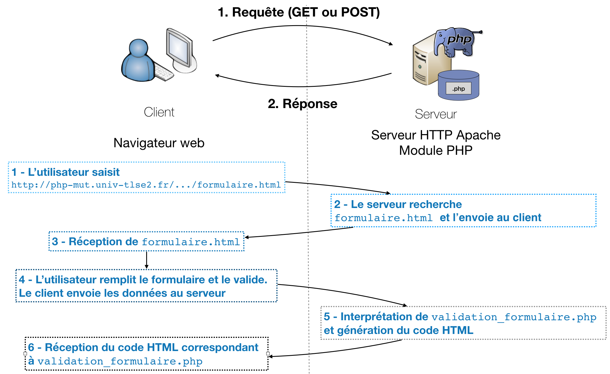

# Manipulation base de données et formulaires


## Interactions avec l'utilisateur 


**Fondée (entre autres) sur la validation de formulaire HTML**

* provoque l'envoi de données vers le serveur
* permet au serveur de générer une page à partir de nouvelles informations en provenance de celui-ci

# Les formulaires

1. Syntaxe HTML
2. Interactions avec le serveur

## Syntaxe HTML
Dans le document HTML (ex: `form.html`)

```html
<html>
<head> … </head>
<body>
  <h1>Veuillez saisir les informations suivantes</h1>
  ###<b>
  <form action="" method=""> <!--form-->
      <label for="nom">Nom :</label> <!--label-->
      <input type="text" size="20" id="nom"/><br /> <!--input text-->
      <label for="prenom">Prenom :</label> 
      <input type="text" size="20" id="prenom" /><br /> 
      <label for="mail">Adresse email :</label> 
      <input type="email" size="22" id="mail"/><br />
      <input type="submit" value="Envoyer" /> <!--input submit-->
  </form>
  ###</b>
</body>
</html> 
```
## Syntaxe HTML - visuel

<div class="exemple">
  <h1>Veuillez saisir les informations suivantes</h1>
  <form action="" method="" onsubmit="return false;"> 
      <label for="nom">Nom :</label> 
      <input type="text" size="20" id="nom"/><br /> 
      <label for="prenom">Prenom :</label> 
      <input type="text" size="20" id="prenom" /><br /> 
      <label for="mail">Adresse email :</label> 
      <input type="email" size="22" id="mail"/><br />
      <input type="submit" value="Envoyer" /> 
  </form>
</div>

## La balise `form`
```html
<form action="traitement" method="choix_methode">
      <!--mettre ici les élements-->
</form>
```

* `traitement` correspond à l'adresse du script qui effectuera le traitement des données saisies (ex: `traitement.php`) 
* `choix_methode` correspond au type de la requête HTTP utilisée pour effectuer le transfert des données pour leur traitement. Deux possibilités : `GET` ou `POST`.


## Les balises du formulaire

### La balise de saisie `input` 
Créer un contrôle interactif qui permet à l'utilisateur de saisir des données.

```html
    <input type="text" size="10" id="prenom" value="caroline"/>
    <input type="date" size="20" id="nom" placeholder="votre date de naissance"/>
```

* `type` correspond au type de l'`input`. La valeur `text` permet de saisir un champ texte simple. Autres types de valeurs : `number`, `color`, `checkbox`, `radio`, `date`, `url`, `file`, `month`, `password`, `submit`, `range` ou `time`.
* `size` : longueur visible du champ (pas de la valeur).
* `value` : valeur par défaut du champ
* `placeholder` : indication, destinée à l'utilisateur, pour ce qui peut être saisi 

Voir Input ([MDN](https://developer.mozilla.org/fr/docs/Web/HTML/Element/Input) , [compatibilité](https://developer.mozilla.org/fr/docs/Web/HTML/Element/Input#Compatibilit%C3%A9_des_navigateurs)) <br>
Voir aussi la balise Textarea ([MDN](https://developer.mozilla.org/fr/docs/Web/HTML/Element/textarea)) 

## Les balises du formulaire 

### La balise de saisie `input` - visuel 

<div class="exemple">
<form action="" method="" onsubmit="return false;">
<label>Input classiques</label>
<label>type "text"</label>
    <input type="text" size="10" id="prenom" value="caroline"/>
<label>type "date"</label>
    <input type="date" size="20" id="date" placeholder="votre date de naissance"/>
<label>type "email"</label>
    <input type="email" size="20" id="email" placeholder="un email"/>
    
<label>Textarea</label>
<textarea name="textarea"
   rows="10" cols="50">
  Vous pouvez écrire quelque
  chose ici.
</textarea>
  <input type="submit" value="Envoyer" />
</form>
</div>

## Les boutons du formulaire

### Bouton d’envoi : 
1. <b style="color:red;">Verifier le format des données saisies au clic.</b>
2. Transmettre les données suivant l’attribut `action` spécifié dans la balise `form`.
```html
<input type="submit" value="Envoyer" />
```

### Bouton de réinitialisation
Reinitialise toutes les valeurs du formulaire aux valeurs par défaut.
```html
<input type="reset" value="Annuler" />
```


### Bouton "libre"
```html
<input type="button" value="Afficher une fleur" />
```


## Les balises du formulaire

### La balise de sélection `select`
```html
<form>
  <label for="enseignement">
  enseignement: </label>
  <select name="nom" id="enseignement">
      <option value="informatique" >Informatique</option>
      <option value="maths" selected="selected">Mathématique</option>
      <option value="lv">Langue vivante</option> 
  </select> <br />
  <input type="submit" value="Envoyer" />
</form>
```
<div class="exemple">
<form onsubmit="return false;">
  <label for="enseignement">
  enseignement: </label>
  <select name="nom" id="enseignement">
      <option value="informatique" >Informatique</option>
      <option value="maths" selected="selected">Mathématique</option>
      <option value="lv">Langue vivante</option> 
  </select> <br />
  <input type="submit" value="Envoyer" />
</form>
</div>

## Organisation du formulaire
Objectif: faciliter les regroupements graphiques et la lisibilité
```html
<form action=""> 
  ###<b>
  <fieldset><legend>Mentions obligatoires</legend> 
  ###</b>
     Nom : <input type="text" size="20" /><br /> 
     Prénom : <input type="text" size="17" /><br /> 
     Adresse email : <input type="text" size="22" /><br /> 
  ###<b>   
  </fieldset>
  ###</b>
  
  <fieldset> <legend>Mentions facultatives</legend> 
      Sexe : 
      <input type="radio" name="sexe" />Masculin 
      <input type="radio" name="sexe" />Feminin<br /> 
      Vos suggestions :<br /> 
      <textarea cols="25" rows="4"></textarea> 
  </fieldset> 
  <p> Bouton d'envoi : <input type="button" value="Envoyer" /> </p> 
</form>
```

## Organisation du formulaire - Visuel

<div class="exemple">
<form action="" onsubmit="return false;"> 
  <fieldset><legend>Mentions obligatoires</legend> 
     Nom : <input type="text" size="20" /><br /> 
     Prénom : <input type="text" size="17" /><br /> 
     Adresse email : <input type="text" size="22" /><br /> 
  </fieldset>

  <fieldset> <legend>Mentions facultatives</legend> 
      Sexe : 
      <input type="radio" name="sexe" />Masculin 
      <input type="radio" name="sexe" />Feminin<br /> 
      Vos suggestions :<br /> 
      <textarea cols="25" rows="4"></textarea> 
  </fieldset> 
  <p> Bouton d'envoi : <input type="button" value="Envoyer" /> </p> 
</form>
</div>


# Interactions avec le serveur

Comment faire pour que le serveur puisse traiter les données saisies dans le formulaire?

## Côté client : le formulaire
 
Le document `connexion.html`, dans la balise `body` :
```html
###<b>
<form action="validation_formulaire.php" method="post">
###</b>
  <p>Nom: <input type="text" size="30" name="nom" /></p>
  <p>Prenom: <input type="text" size="20" name="prenom" /></p>
  <p><input type="submit" name="btAction" value="OK" />
    <input type="reset" name="btAnnuler" value="Annuler" /></p>
</form>
```

Rappel

* `validation_formulaire.php` correspond au fichier PHP qui effectuera le traitement des données saisies (attribut `action`).
* `POST` correspond au type de la requête HTTP utilisée pour effectuer le transfert des données (attribut `method`). 

<span style="color:red;">Donner un **nom à chaque élément du formulaire** : ce nom permet ensuite de retrouver les valeurs saisies par l'utilisateur</span>

## Visuel
`connexion.html`

<div class="exemple">
<form action="" method="post" onsubmit="return false;">
  <p>Nom: <input type="text" size="30" name="nom" /></p>
  <p>Prenom: <input type="text" size="20" name="prenom" /></p>
  <p><input type="submit" name="btAction" value="OK" />
    <input type="reset" name="btAnnuler" value="Annuler" /></p>
</form>
</div>


## Côté serveur : traitement du formulaire
Le formulaire précédent est traité par `validation_formulaire.php` :

```html
...
<body>
		<?php 
			if (empty($_POST["nom"]) or empty($_POST["prenom"])) {
					echo "Vous devez saisir un nom et un prénom !";
			} 
			else {
				$nom = $_POST["nom"];
				$prenom = $_POST["prenom"];
				echo "Bonjour $prenom $nom";
			}
		?>
</body>
```

## Côté serveur : traitement du formulaire - visuel

### Rappel du formulaire 

<div class="exemple">
<form action="" method="post" onsubmit="return false;">
  <p>Nom: <input type="text" size="30" name="nom" value="Dupont"/></p>
  <p>Prenom: <input type="text" size="20" name="prenom" value="Marie"/></p>
  <p><input type="submit" name="btAction" value="OK" />
    <input type="reset" name="btAnnuler" value="Annuler" /></p>
</form>

</div>

### Si le formulaire est rempli le serveur retourne 

<div class="exemple">
Bonjour Dupont Marie
</div>

### Sinon: 

<div class="exemple">
Vous devez saisir un nom et un prénom !
</div>

## Cycle (simplifié)



1. Le navigateur rassemble les informations saisies dans le formulaire (nom et prénom) et les envoie par une méthode `POST` (ou `GET`) au serveur

2. Le serveur interprète `validation_formulaire.php` avec les données reçues et génère un flux HTML résultat renvoyé au navigateur


## Cycle (complet)

> 1. L’utilisateur se rend à l'adresse [http://mi-phpmut/.../formulaire.html]()
> 2. Le serveur recherche `formulaire.html`
> 3. Le navigateur client récupère `formulaire.html`
> 4. L'utilisateur remplit le formulaire et le valide. Le client envoie les données au serveur 
> 5. Le serveur interprète `validation_formulaire.php` et génère le code HTML résultat renvoyé au navigateur
> 6. Le navigateur reçoit et affiche le code HTML correspondant à `validation_formulaire.php`

## Cycle complet - visuel 




## PHP : Variables globales permettant l’échange client / serveur

`$_POST[…]` ou `$_GET[…]`

* Variables globales permettant de récupérer les valeurs transmises au programme PHP par la requête client.
* Hachages dont les clés correspondent aux **noms** donnés dans le formulaire à chaque élément du formulaire, et les valeurs à la valeur saisie par l'utilisateur pour chacun de ces éléments.

## Mise en pratique : TP
### Faire l'exercice 1.

# Formulaire d'interrogation

## Exemple - Formulaire d'interrogation

`formulaire2.html`
<div class="medium columns-2">
```html
...
<body>
  <form action="exemple2search.php" method="get">
    Ce formulaire vous permet d'indiquer des paramètres pour 
    la recherche d'employés:
    <p>
    Nom : <input type="text" size="20" name="fnom" value="%"><br />
    le caractère % remplace n'importe quelle chaîne.</p>
    <p> Année de naissance: 
    	<input type="text" name="fnaissance" value="1900"><br />
    <b> Comment combiner ces critères ? </b>
    et <input type="radio" name="fcomb" value="et" checked="checked">
    ou <input type="radio" name="fcomb" value="ou">?
    </p>
    <input type=submit value='rechercher'>
  </form>
</body>
```

<div class="exemple">
  <form action="" method="get" onsubmit="return false;">
    Ce formulaire vous permet d'indiquer des paramètres pour 
    la recherche d'employés:
    <p>
    Nom : <input type="text" size="20" name="fnom" value="%"><br />
    le caractère % remplace n'importe quelle chaîne.</p>
    <p> Année de naissance: 
    	<input type="text" name="fnaissance" value="1900"><br />
    <b> Comment combiner ces critères ? </b>
    et <input type="radio" name="fcomb" value="et" checked="checked">
    ou <input type="radio" name="fcomb" value="ou">?
    </p>
    <input type=submit value='rechercher'>
  </form>
</div>
<br/>
<br/>
<br/>
</div>

## Exemple - Script PHP associé au formulaire
`exemple2search.php` avec une table `Employes [Id,Nom,Prenom,Naissance]` 

<div class="columns-2 medium">
```php
<html>
<head>...</head>
<body>
<?php
  require("connect.php");
  
  // on récupère les valeurs du formulaire
  ###<b>
  $vnom = $_GET['fnom'];
  $vnaissance = $_GET['fnaissance'];
  $vcomb = $_GET['fcomb'];
  ###</b>
  
  echo "Requête : <b>Nom=$vnom et naissance=$vnaissance";
  echo " et combinaison=$vcomb</b><br/>";
  
  // création de la requête
  if ($vcomb == "et")
      $requete = "select * from Employes where Nom like '$vnom' 
                and Naissance=$vnaissance";
  else
      $requete="select * from Employes where Nom like '$vnom' 
                or Naissance=$vnaissance";
  
  
  $connexion = mysqli_connect(SERVEUR,NOM,PASSE);
  mysqli_select_db($connexion,BASE);
  
  // exécution et affichage du résultat
  $resultat = mysqli_query($connexion,$requete);
  
  while ($emp = mysqli_fetch_object ($resultat)){
    echo "$emp->Id, de nom $emp->Nom $emp->Prenom, né le  
          $emp->Naissance<BR>\n";
  }
 ?>
</body>
</html>   

```
</div>

<b>Les champs du formulaires sont dans le tableau `$_GET` (méthode GET spécifiée dans le formulaire HTML)</b>


# Formulaire de mise à jour

## Exemple - Formulaire de mise à jour
`insertion.html`

<div class=" medium">
```html
<html>
<head>
  <title>formulaire de mise à jour</title>
</head>
<body>
  Insertion dans la table employes:  <br/>
  <form action="exemple3update.php" method="post">
    nom: <input type="text" size="20" name="fnom"><br>
    prénom: <input type="text" size="20" name="fprenom"><br>
    année naissance: <input type="text" size="4" name="fnaissance"><br>
    <input type="submit" value="insérer">
  </form>
</body>
</html>
```
</div>

<div class="exemple">
  Insertion dans la table employes:  <br/>
  <form action="" method="post" onsubmit="return false;">
    nom: <input type="text" size="20" name="fnom"><br>
    prénom: <input type="text" size="20" name="fprenom"><br>
    année naissance: <input type="text" size="4" name="fnaissance"><br>
    <input type="submit" value="insérer">
  </form>
</div>

## Exemple - Script PHP associé au formulaire de mise à jour
`exemple3update.php`

<div class="columns-2 medium">
```php
<html>
<body>
<?php
  require("connect.php");
  
  //récupération des variables
  ###<b>
  $vnom = $_POST['fnom'];
  $vprenom = $_POST['fprenom'];
  $vnaissance = $_POST['fnaissance'];
  ###</b>
  
  $connexion = mysqli_connect(SERVEUR,NOM,PASSE);
  mysqli_select_db($connexion,BASE);
  
  $requete="insert into employes(nom,prenom,naissance) 
            values ('$vnom','$vprenom',$vnaissance)";
            
  $resultat = mysqli_query($connexion,$requete);
  if ($resultat){
    echo "<br>la requête a été effectuée.";}
  else {  
    echo "la requête n'a pas pu être effectuée 
          pour la raison suivante:".mysqli_error($connexion); }
?>
</body>
</html>
```
</div>


## Lignes de sélection

```html
<form>
  Enseignement: 
  <select name="nom" >
      <option value="informatique" selected="selected">Informatique</option>
      <option value="maths">Mathématique</option>
      <option value="lv">Langue vivante</option> 
  </select> <br />
  <input type="submit" value="Envoyer" />
</form>
```
<div class="exemple">
<form method="POST" onsubmit="return false;">
  Enseignement: 
  <select name="nom" >
      <option value="informatique" selected="selected">Informatique</option>
      <option value="maths">Mathématique</option>
      <option value="lv">Langue vivante</option> 
  </select> <br />
  <input type="submit" value="Envoyer" />
</form>
</div>

## Choix multiples

On veut récupérer plusieurs sélections faites par l'utilisateur côté client :

```html
<form method="post" action="manger.php">
  <select name="dejeuner[]" multiple>
      <option value="jambon">Sandwich au jambon</option>
      <option value="poulet">Sandwich au poulet</option>
      <option value="thon">Sandwich au thon</option>
      <option value="gruyère">Sandwich au gruyère</option>
  </select>
<input type="submit" name="soumettre">
```

Côté serveur, en PHP, `$_POST['dejeuner']` est un tableau contenant les valeurs sélectionnées :

```php
foreach ($_POST['dejeuner'] as $choix){
	echo "Vous avez pris un sandwich au $choix. <br />";
}
```

# Formulaire validé par lui-même 

## Formulaire validé par lui-même 

Dans le premier exemple, lorsque l'utilisateur s'est trompé ou s'il veut faire une nouvelle saisie, il doit revenir en arrière en utilisant la touche back du navigateur

Il est souvent plus judicieux d'afficher le formulaire et le résultat sur une même page.

## Exemple `toutenun.php` 1/2

```php
...
<body>
	<div>
		<?php
			 ###<b>
			 if ($_SERVER["REQUEST_METHOD"] == "POST") {
			 ###</b>
				// Est appelé par la méthode POST, donc en validation du formulaire
				if (empty($_POST["nom"])or empty($_POST["prenom"])) {
					echo "Vous devez saisir un nom et un prénom !";	
				} 
				else {
					$nom = $_POST["nom"];
					$prenom = $_POST["prenom"];
					echo "Bonjour $prenom $nom";
				}
			 }
		?>
... (suite)
```
## Exemple `toutenun.php` 2/2

```php
		<form action="toutenun.php" method="post">
		  	<p><label for="nom">Nom :</label>
	     	<input type="text" size="30" name="nom" />
			</p>
		  	<p><label for="prenom">Prénom :</label>
		    <input type="text" size="20" name="prenom" />
			</p>
			<p><input type="submit" name="btAction" 
				value="OK" />
			<input type="reset" name="btAnnuler" 
				value="Annuler" />
			</p>
		</form>
	</div>
</body>
...
```

# Mise en pratique

## TP

### Faire les exercices 1, 2 et 3


# Références

## Manuel de référence

* http://www.php.net/manual/fr/

### Pour avoir des exemples
* http://www.phpfrance.com/
* http://www.manuelphp.com