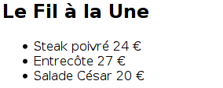

#Exercice 1

1. Créez un dossier `TP2` et la page `calcul.php`. 
2. Dans cette page, vous devez définir un tableau avec le nom et le prix hors taxe (HT) de 5 articles. 
3. Vous devez ensuite parcourir ce tableau et, pour chaque article, vous devez calculer le prix TTC (vous devez considérer une taxe 
de 15 %). 
4. Vous devez afficher le nom, le prix HT et le prix TTC dans un tableau HTML. 
5. Affichez également dans ce tableau HTML la somme des prix HT et la somme des prix TTC. 
6. Déposez le fichier sur le serveur `mi-phpmut` et visualisez son contenu. 

#Exercice 2
Modifiez le code de la page `informatique.php`, que vous avez créée pour l'[exercice 3](../TP1/tp1.html#exercice-3) du TP1 de PHP (Séance 1) :  

1. Définissez une fonction prenant en paramètre une chaîne de caractères et renvoyant cette chaîne de caractère en majuscule.
2. Utilisez cette fonction pour qu’elle affiche en majuscule le jour de la semaine où vous avez cours d’informatique. 

#Exercice 3
Modifiez le code de la page `calcul.php`, que vous avez créée pour l'[exercice 1](#exercice-1):  

1. Définissez une fonction prenant en paramètre le prix HT du produit et  renvoyant le prix TTC. 
2. Utilisez cette fonction pour qu’elle calcule les valeurs TTC ; affichez dans le tableau HTML. 
3. Définissez une fonction prenant en paramètre le tableau d'articles et renvoyant la somme de leurs prix HT. 

#Exercice 4
Créer la page `restaurants.php`. Dans cette page, vous devez  :  

1. définir un tableau associatif avec le nom et la carte (paires plat-prix) de 5 restaurants. Chaque restaurant doit au moins proposer 3 plats. Les cartes  doivent être des tableaux associatifs.
2. parcourir les restaurants pour afficher le nom du restaurant en titre de niveau 2 et les paires plat-prix dans une liste à puces. Ainsi, pour chaque restaurant, un rendu HTML semblable à celui-ci doit être produit : 

3. ajouter une feuille CSS pour souligner les noms des restaurants et mettre en couleur bleue et en italique uniquement les noms des plats lorsque le curseur de la souris passe au-dessus.

