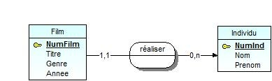
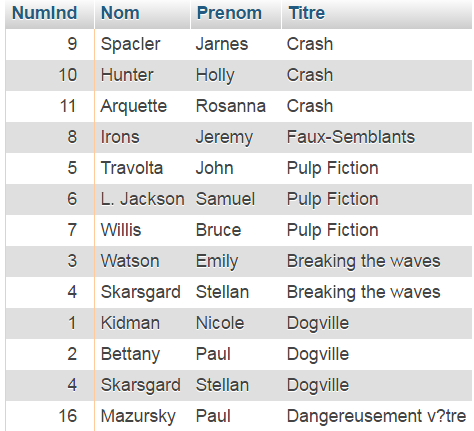

#Exercice 1

1. Téléchargez depuis IRIS le script SQL contenu dans l'archive `Cinema.zip`. 

2. Importez-le à partir de l’interface phpMyAdmin pour créer une BD décrite par le schéma conceptuel (schéma E-A) suivant :

Le nom des tables est préfixé par `L2_`

3. Étudiez la structure des tables générées :
  * typage des champs
  * définition des clés primaire 
  * définition des clés étrangères (Cf. "Vue relationnelle")

4. Visualisez le contenu des tables

#Exercice 2

1. Créez un répertoire TP3 dans public_html

2. Créez puis déposez dans ce dossier TP3, la page php `films.php` qui contient : 
  * Un titre de niveau 2 de nom « Films ».
  * La liste de tous les films (numéro de film, titre, prénom et nom du réalisateur),  présentée sous forme d'une liste à puces.

3. Modifiez le code php de la page `films.php` pour que les informations relatives à chaque film soit présentée sous forme d'un tableau HTML (`<table>...</table>`).

4. Ajouter dans la page `films.php` 
  * Un titre de niveau de 2 de nom « Films du genre Drame ».
  * Un tableau contenant les informations relatives aux films de type "Drame" (numéro de film, titre, nom du réalisateur).

5. Affichez dans la page `films.php` 
  * Un titre de niveau 2 de nom « Nombre de films par genre».
  * Le nombre de films mémorisés par genre.

#Exercice 3

1. Modifiez la base de données pour pouvoir stocker les individus jouant dans un film (numéro, nom, prenom). Compléter le schéma E-A. Attention un individu peut jouer dans plusieurs films.
2. Insérez les tuples pour mémoriser les films dans lesquels les individus ont joué suivants :

{width=400px}

3. Modifiez la page `films.php` pour :
  * insérer un titre de niveau 2 de nom « Acteurs»
  * afficher pour le numéro de l'individu le nombre de films dans lequel il a joué.
  * afficher pour chaque individu (numéro, prénom, nom) le nombre de films dramatiques dans lequel il a joué.

